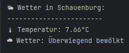

# 🌤 WeatherCLI – Ein einfaches Wetterprogramm für die Konsole

**WeatherCLI** ist eine kleine Java-Anwendung, die aktuelle Wetterdaten für eine Stadt von der **OpenWeatherMap API** abruft und in der Konsole anzeigt.

## **Beispiel-Screenshot**

Hier ist ein Screenshot der Konsolen-Ausgabe:




##  **Funktionen**

- Ruft aktuelle Wetterdaten über die **OpenWeatherMap API** ab  
- Zeigt Temperatur und Wetterbeschreibung in der Konsole  
- Unterstützt mehrere Städte weltweit  
- Fehlerbehandlung bei ungültigen Städtenamen

---

#  **Installation & Nutzung**

##  **Voraussetzungen**

- **Java 8+** installiert
- **Internetverbindung**
- **OpenWeatherMap API-Schlüssel**
- **Maven oder eine IDE (IntelliJ/Eclipse)** zur Ausführung

##  **Installation**

### **Projekt klonen:**
```bash
git clone https://github.com/dein-benutzername/WeatherCLI.git
cd WeatherCLI
```
### **Java-Programm ausführen:**

Das Programm wird mit einer Stadt als Argument gestartet.

```bash
java -cp target/WetterCLI-1.0-SNAPSHOT.jar WeatherCLI Schauenburg
```
## **Code-Übersicht**
**getWeatherData(String town)**

- Erstellt eine HTTP-Anfrage zur OpenWeatherMap API
Wandelt die JSON-Antwort in ein JsonNode-Objekt um

**showWeather(JsonNode rootNode)**

- Liest die Wetterinformationen aus
Gibt die Temperatur und Wetterbeschreibung in der Konsole aus


## **API & Quellen**
- OpenWeatherMap API: https://openweathermap.org/api
- Java HTTP-Client (OkHttp): https://square.github.io/okhttp


## **Lizenz**
Dieses Projekt ist unter der MIT-Lizenz lizenziert. Weitere Informationen finden Sie in der [LICENSE](LICENSE.md)-Datei.

## **Kontakt**
- Autor: Pawel Sala
- E-Mail: [pawel.sala@web.de](mailto:pawel.sala@web.de)
- GitHub: https://github.com/PawelUKS
- Bei Fragen, Problemen oder Verbesserungsvorschlägen können Sie gerne Kontakt aufnehmen oder ein Issue im GitHub-Repository erstellen.