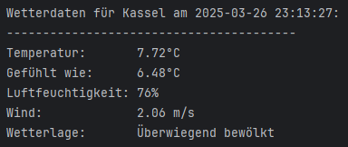
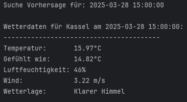
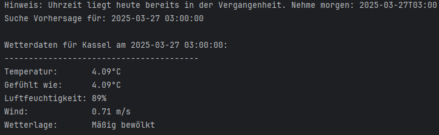
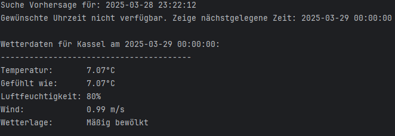
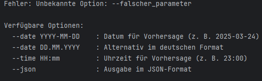
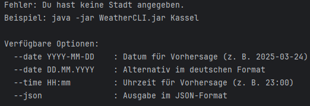

# WeatherCLI – Konsolen-Wettertool mit Forecast, JSON & Docker

## ✅ Build Status


**WeatherCLI** ist eine moderne Java-CLI-Anwendung, die Wetterdaten von der **OpenWeatherMap API** abruft – inklusive **aktueller Wetterlage**, **Vorhersage** (mit Datum/Uhrzeit), **Fehlertoleranz**, **JSON-Ausgabe**, und **Docker-Support**.

##  Features

- Aktuelles Wetter für beliebige Städte
- Vorhersage per `--date` und `--time`
- Intelligente Erkennung ungültiger oder veralteter Eingaben
- JSON-Ausgabe via `--json`
- Vollständig Docker-kompatibel (kein Java/Maven nötig)
- Erste Unit-Tests mit JUnit integriert
- Benutzerfreundliche Fehler- und Hilfeausgabe
---

## Beispiele & Screenshots

### Nur Stadt angegeben
Zeigt das aktuelle Wetter für die Stadt an.



---

### Stadt + Datum + Uhrzeit
Zeigt die Wettervorhersage zur gewünschten Uhrzeit.



---

### Stadt + Uhrzeit in der Vergangenheit
Das Programm erkennt, dass die Uhrzeit bereits vergangen ist, und verschiebt automatisch auf den nächsten Tag.


---

### Stadt + Datum
Vorhersage für ein konkretes Datum.


---

### Ungültiger Parameter
Fehlermeldung bei nicht erkannten Parametern.


---

### Fehlende Stadtangabe
Wird keine Stadt übergeben, erscheint ein Hilfetext.


---

## Installation & Nutzung

### Voraussetzungen (für Entwickler)

- Java 17+
- Maven
- OpenWeatherMap API-Key *(im Code bereits vorkonfiguriert)*
- (Optional) Docker

---

### Projekt klonen

```bash
git clone https://github.com/PawelUKS/WeatherCLI.git
cd WeatherCLI
```

---

### Lokal mit Java/Maven starten

```bash
mvn clean package
java -jar target/WeatherCLI-1.0-SNAPSHOT-jar-with-dependencies.jar Kassel --date 2025-03-28 --time 14:00 --json
```

---

### Mit Docker ausführen (ohne Java/Maven)

```bash
docker build -t weather-cli .
docker run weather-cli Kassel --date 2025-03-28 --time 14:00
```

---

### Unit-Tests ausführen

```bash
mvn test
```

---

## Beispiel

```bash
docker run weather-cli Kassel --date 2025-03-28 --time 14:00
```

Ausgabe:
```
Wetterdaten für Kassel am 2025-03-28 15:00:00:
----------------------------------------
Temperatur:       15.83°C
Gefühlt wie:      14.62°C
Luftfeuchtigkeit: 44%
Wind:             1.96 m/s
Wetterlage:       Klarer Himmel
```

---

## Verfügbare Optionen

```bash
--date YYYY-MM-DD    Datum für Vorhersage (z. B. 2025-03-24)
--date DD.MM.YYYY    Alternativ im deutschen Format
--time HH:mm         Uhrzeit für Vorhersage (z. B. 23:00)
--json               JSON-Ausgabe statt Klartext
```

---

## Projektstruktur (Kurzfassung)

```
src/
├── main/java/WeatherCLI.java         ← Haupt-Logik
├── test/java/WeatherCLITest.java     ← Unit-Tests
Dockerfile                            ← Für Build & Run via Docker
.github/workflows/ci.yml              ← GitHub Actions Workflow
pom.xml                               ← Maven-Konfiguration
```

---

## API

- OpenWeatherMap API → [https://openweathermap.org/api](https://openweathermap.org/api)
- Ein gültiger API-Key ist bereits im Code vorkonfiguriert – du kannst WeatherCLI direkt testen.

---

## Lizenz

MIT License – siehe [LICENSE](LICENSE.md)

---

## Kontakt

**Autor:** Pawel Sala  
E-Mail: [pawel.sala@web.de](mailto:pawel.sala@web.de)  
GitHub: [@PawelUKS](https://github.com/PawelUKS)

> Feedback, Issues & Pull Requests sind willkommen!